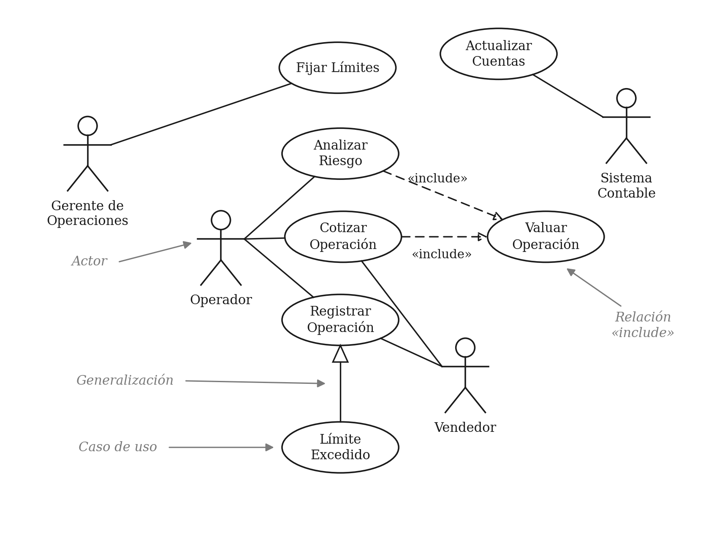
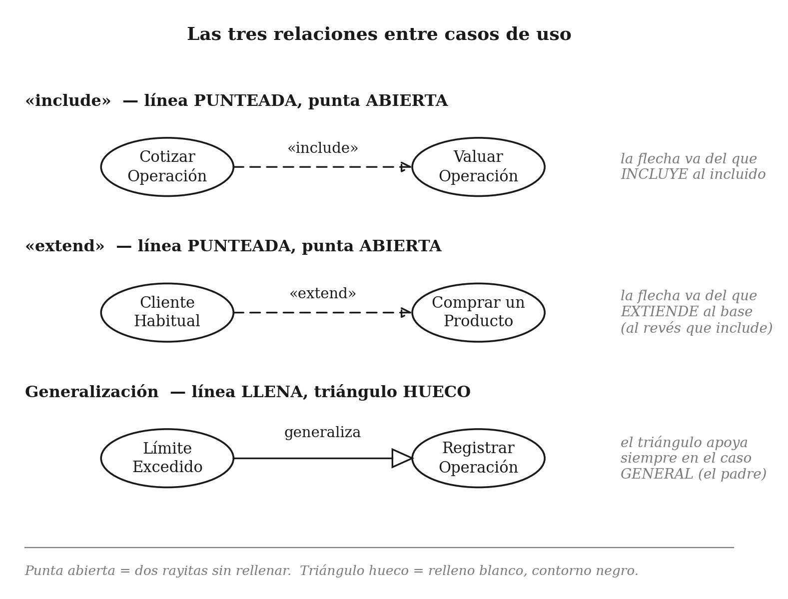
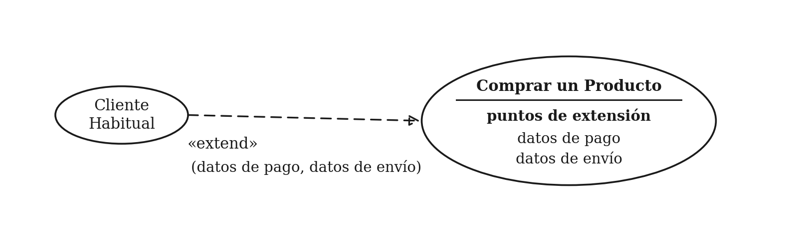

# Casos de Uso

**Ingeniería de Requisitos — UTN FRBA — 2C 2026**

> Versión en español del material de lectura del aula virtual sobre casos de uso. Cubre los mismos temas y la misma notación, escrito de cero y calibrado a lo que evalúa la cátedra. No hace falta volver al original en inglés para entender nada de acá.

**Cómo leer las marcas:** 🔴 central y evaluable · 🟡 secundario · 🟢 mencionado al pasar.

Los bloques `📋 Para el parcial` son respuestas listas. Los bloques `⚠️` avisan dónde el autor del material opina distinto de lo que corrige la cátedra: ahí mandan las reglas de la materia.

---

## 1. De dónde salen los casos de uso

### 🟡 1.1 El problema que vienen a resolver

Para construir un sistema hay que entender antes qué se espera que haga. Durante mucho tiempo, la forma natural de hacerlo fue conversar sobre situaciones típicas: "el cliente entra, busca un producto, lo paga". Eso funcionaba, pero se hacía de manera informal — se hablaba y no quedaba registrado en ningún lado. El resultado era previsible: cada persona del equipo recordaba una versión distinta de lo conversado.

Ivar Jacobson fue quien convirtió esa práctica informal en una técnica con nombre, notación y lugar propio dentro del proceso de desarrollo. Su método (Objectory) y su libro de 1992 pusieron al caso de uso en el centro: dejó de ser una charla y pasó a ser un artefacto que se escribe, se revisa y se planifica. Desde entonces la técnica se adoptó de forma masiva.

Retené esto porque es el fundamento de toda la materia: **un caso de uso no es una función del software, es una interacción entre alguien de afuera y el sistema, descrita desde el punto de vista de ese alguien.**

---

## 2. Escenario y caso de uso

### 🔴 2.1 Qué es un escenario

Antes del caso de uso viene el escenario, porque el caso de uso se define a partir de él.

Un **escenario** es una secuencia de pasos que describe una interacción concreta entre un usuario y el sistema. Es un camino, uno solo: lo que pasa en ese recorrido puntual, de principio a fin.

Supongamos una tienda en línea. Un escenario de compra sería el siguiente: el cliente recorre el catálogo y va agregando productos al carrito; cuando decide pagar, indica los datos de envío y los de su tarjeta y confirma la compra; el sistema verifica que la tarjeta esté autorizada y le confirma la venta en pantalla, y además le manda un correo de confirmación.

Ese es un escenario. Pero es solamente uno de los que pueden ocurrir. La autorización de la tarjeta puede fallar, y en ese caso lo que sucede es distinto: ese es otro escenario. Y si el cliente ya compró antes y el sistema lo reconoce, el recorrido vuelve a ser diferente: otro escenario más.

> 🕳️ **Madriguera — la palabra "escenario" se usa con dos sentidos distintos en esta materia**
> Acá, escenario = un camino posible de una interacción. Más adelante en la cursada (unidades 5 y 6) vas a ver Escenario como un artefacto formal, con estructura fija: título, objetivo, contexto, actores, recursos y episodios. Son dos cosas diferentes con el mismo nombre, y la clase del 22/10 se llama justamente "CU vs. Escenario".
> *Volvé al camino — esto se profundiza aparte, otro día.*

### 🔴 2.2 Qué es un caso de uso

Un **caso de uso** es el conjunto de escenarios vinculados por un mismo objetivo del usuario.

Con el ejemplo anterior: los tres escenarios (compra exitosa, tarjeta rechazada, cliente ya conocido) no son tres cosas sueltas — los tres persiguen el mismo objetivo, que es comprar un producto. Entonces forman un único caso de uso, "Comprar un Producto", con varios escenarios adentro.

La estructura típica se repite siempre: hay un escenario principal, donde todo sale bien, y alrededor de él una cantidad de alternativas. Esas alternativas no son solo errores; también incluyen caminos donde todo sale bien pero de otra manera (el caso del cliente ya registrado es exactamente eso).

> 📋 **Para el parcial, si te preguntan la diferencia entre escenario y caso de uso**
> Un escenario es una secuencia de pasos que describe una interacción puntual entre un usuario y el sistema — un camino. Un caso de uso es el conjunto de escenarios que comparten un mismo objetivo del usuario. La relación es de contención: el caso de uso agrupa, el escenario es cada camino individual.

### 🔴 2.3 Cómo se escribe un caso de uso

La forma más común de documentarlo es escribir el escenario principal como una lista numerada de pasos, y las alternativas como variaciones que se enganchan a un número de paso concreto.

**Comprar un Producto**

1. El cliente recorre el catálogo y selecciona los productos que quiere comprar.
2. El cliente pasa a la pantalla de pago.
3. El cliente completa los datos de envío: dirección y modalidad de entrega (24 horas o 3 días).
4. El sistema muestra el precio total, con el costo de envío incluido.
5. El cliente completa los datos de la tarjeta de crédito.
6. El sistema autoriza la compra.
7. El sistema confirma la venta en pantalla.
8. El sistema envía un correo de confirmación al cliente.

**Alternativa: *fallo de autorización***

En el paso 6, el sistema no logra autorizar la compra con la tarjeta. Se le permite al cliente volver a cargar los datos de la tarjeta y reintentar.

**Alternativa: *cliente ya registrado***

3a. El sistema muestra los datos de envío, el precio y los últimos cuatro dígitos de la tarjeta que el cliente ya tenía cargados.
3b. El cliente puede aceptar esos datos o reemplazarlos.
Se retoma el escenario principal en el paso 6.

Prestá atención a dos detalles de redacción, porque son exactamente los que se corrigen: **cada paso dice quién hace la acción** ("el cliente completa", "el sistema autoriza" — nunca un impersonal donde no se sabe quién actúa), y **la alternativa declara en qué paso se engancha y a qué paso vuelve**. Una alternativa que no dice dónde entra ni dónde sale es ambigua.

> ⚠️ **Sobre la plantilla:** UML no estandariza qué secciones lleva un caso de uso escrito, así que existen muchas variantes (precondiciones, postcondiciones, disparador, actores involucrados, y otras). El material original recomienda elegir las que a uno le sirvan. **En la materia eso no corre: usá la plantilla que dé la cátedra, con las secciones que pida, aunque te parezcan de más.**

### 🟢 2.4 Cuánto detalle poner

El criterio general es que el nivel de detalle debería seguir al riesgo: cuanto más riesgoso o incierto es un caso de uso, más conviene detallarlo. En un proyecto real es normal que solo unos pocos casos de uso estén muy desarrollados y el resto quede en el nivel del ejemplo de arriba, agregando detalle a medida que se los va a construir.

> ⚠️ El material original agrega que no hace falta escribir todo el detalle, porque la comunicación verbal suele alcanzar. **Ese consejo es de práctica profesional y va en contra de lo que se evalúa acá: la materia pide requisitos específicos, concretos, no ambiguos, verificables y trazables. Nada de eso sobrevive si queda hablado. Para el parcial: se documenta.**

---

## 3. El diagrama de casos de uso

### 🔴 3.1 Qué muestra el diagrama

Además de la técnica, Jacobson introdujo una notación gráfica para verla de un vistazo. Ese diagrama hoy forma parte de UML y es el que vas a dibujar y te van a corregir.

Este es un diagrama de casos de uso de un sistema de operaciones financieras. Las etiquetas grises no son parte del diagrama: están puestas para señalar cada elemento.

*Figura 1 — Diagrama de casos de uso de un sistema de operaciones financieras*

Los elementos que ves son cuatro:

- **Actor**: el monigote. Representa un rol.
- **Caso de uso**: la elipse, con el nombre adentro.
- **Asociación**: la línea llena y sin punta que une un actor con un caso de uso. Significa que ese rol participa de ese caso de uso.
- **Relaciones entre casos de uso**: las flechas punteadas «include» y el triángulo hueco de la generalización. Van en la sección 6.

> ⚠️ El material original aclara que no es obligatorio dibujar un diagrama para trabajar con casos de uso, y cuenta un proyecto donde se usaron fichas de papel. **En esta materia el diagrama sí es obligatorio y la notación se corrige sin margen: una inclusión mal dibujada o un actor mal puesto se descuenta. La sección 6 de este documento es la que más te conviene tener fresca.**

---

## 4. Actores

### 🔴 4.1 Un actor es un rol, no una persona

Un **actor** es el rol que alguien juega frente al sistema. Esta es la definición y conviene que te la sepas con esa palabra: ***rol***, no persona, no puesto de trabajo, no usuario individual.

En la Figura 1 hay cuatro actores: Gerente de Operaciones, Operador, Vendedor y Sistema Contable.

La distinción importa por dos motivos concretos. Primero, en la organización puede haber cincuenta operadores, pero para el sistema todos juegan el mismo rol: es un solo actor. Segundo, una misma persona puede jugar varios roles — un operador con antigüedad puede ser también Gerente de Operaciones, y un Operador puede además cumplir el rol de Vendedor. Si modelás personas en lugar de roles, esto no se puede representar.

> 📋 **Para el parcial, si te preguntan qué es un actor**
> Un actor es un rol que un usuario juega respecto del sistema, no una persona ni un puesto. Varias personas pueden compartir un mismo actor, y una misma persona puede actuar como varios actores distintos según el rol que esté cumpliendo en cada momento.

### 🔴 4.2 Un actor no tiene por qué ser humano

Aunque se dibuje como monigote, un actor puede ser otro sistema que interactúa con el nuestro. En la Figura 1, el Sistema Contable es un actor: necesita que se le actualicen las cuentas. Es un sistema externo, no una persona, y se dibuja igual.

### 🟡 4.3 Qué actores se muestran

Acá hay variantes de criterio. Algunos muestran a todo actor externo que toque el sistema; otros solo al que dispara el caso de uso; y otros — el criterio que sigue el material — al actor que obtiene valor del caso de uso, que suele llamarse actor primario.

El criterio del valor tiene una consecuencia útil: obliga a preguntarse para quién se hace cada cosa. Cuando un caso de uso solo tiene sistemas como actores, conviene revisarlo — a veces detrás de ese sistema hay un objetivo humano que no quedó modelado.

> ⚠️ El material original dice que no se preocupa demasiado por las relaciones exactas entre actores y casos de uso, mientras salgan bien los casos de uso. **Ese es justamente el punto donde la cátedra es más estricta: la notación y la granularidad de los roles se corrigen una por una. Nombrá los roles con precisión y revisá cada línea de asociación.**

### 🟢 4.4 Casos de uso sin un actor evidente

A veces cuesta encontrar el actor. El ejemplo clásico es una empresa de servicios que emite facturas: "Emitir Factura" es claramente un caso de uso, pero ningún rol lo pide. La factura le llega al cliente, y el cliente no protestaría si no llegara. El actor más razonable termina siendo el área de Facturación, porque es quien obtiene el valor, aunque no participe del recorrido.

Si un caso de uso no cae claramente bajo ningún actor, no lo fuerces: lo importante es que el caso de uso y el objetivo que satisface estén bien entendidos.

---

## 5. Cómo encontrar los casos de uso

### 🟡 5.1 Empezar por los actores

Frente a un sistema grande, hacer una lista de casos de uso de la nada es difícil. Es mucho más manejable listar primero los actores y después preguntarse, rol por rol, qué necesita hacer cada uno. Los actores funcionan como puerta de entrada.

Además, tener los actores identificados sirve después: si el sistema se va a configurar distinto según el tipo de usuario, cada tipo es un actor y sus casos de uso te dicen qué necesita; y saber quién pide cada caso de uso ayuda a negociar prioridades cuando no entra todo.

### 🟡 5.2 Empezar por los eventos externos

La otra vía es preguntarse a qué hechos del mundo exterior tiene que reaccionar el sistema. Cada evento al que hay que responder es una pista de un caso de uso. Algunos eventos generan una reacción con participación de usuarios y otros una reacción interna del sistema, pero en ambos casos sirven para descubrir casos de uso que por la vía de los actores no habrían aparecido.

---

## 6. Relaciones entre casos de uso

**Esta es la sección más evaluable del documento. Son tres relaciones, y lo que se corrige es de qué tipo es la línea, hacia dónde apunta la flecha y qué forma tiene la punta.**

*Figura 2 — Notación de las tres relaciones. Tenela a mano al dibujar.*

### 🔴 6.1 Inclusión — «include»

Se usa cuando un mismo comportamiento aparece en dos o más casos de uso y no querés repetir la descripción en cada uno.

En la Figura 1 pasa exactamente eso: tanto Analizar Riesgo como Cotizar Operación necesitan valuar la operación, y describir esa valuación lleva bastante texto. En lugar de escribirlo dos veces, se separa en un caso de uso propio, Valuar Operación, y los otros dos lo incluyen.

**Notación:** línea punteada con punta de flecha abierta, **desde el caso de uso que incluye hacia el caso de uso incluido**, con el estereotipo «include» sobre la línea. La dirección importa: si la invertís, estás diciendo lo contrario.

*Cómo memorizar la dirección: la flecha se lee "necesita a". Cotizar Operación necesita a Valuar Operación.*

> 📋 **Para el parcial, si te preguntan cuándo usar «include»**
> Cuando el mismo comportamiento se repite en dos o más casos de uso y se quiere evitar la duplicación. Se extrae ese comportamiento común a un caso de uso separado y los demás lo incluyen. La flecha punteada va del caso de uso que incluye hacia el incluido.

### 🔴 6.2 Generalización entre casos de uso

Se usa cuando un caso de uso es parecido a otro pero hace algo más, o algo distinto. Es otra forma de capturar un escenario alternativo: en vez de dejarlo como variación dentro del caso de uso, se le da entidad propia.

En la Figura 1, el caso de uso base es Registrar Operación: el camino donde todo va bien. Pero puede pasar que se supere un límite — por ejemplo, el monto máximo que la organización fijó para ese cliente. Ahí el comportamiento habitual no se ejecuta, se ejecuta uno alternativo. Esa variación podría haber quedado como una alternativa escrita dentro de Registrar Operación, igual que hicimos con el fallo de autorización en la sección 2.3. Pero si es lo bastante distinta, conviene sacarla a un caso de uso propio: Límite Excedido.

El caso de uso especializado puede reemplazar cualquier parte del caso de uso base, pero tiene que seguir apuntando al mismo objetivo esencial del usuario. Si el objetivo cambió, no es una especialización: es otro caso de uso.

**Notación:** línea llena con **triángulo hueco apoyado en el caso de uso general** (el padre). Va del específico al general. Es la misma notación que la herencia entre clases, y es donde más se equivoca la gente: el triángulo nunca va del lado del caso especializado.

### 🔴 6.3 Extensión — «extend»

Es parecida a la generalización, pero con reglas más estrictas — es la versión controlada de la misma idea.

Acá el caso de uso que extiende agrega comportamiento al caso de uso base, pero no puede hacerlo en cualquier lado: el caso base tiene que declarar explícitamente sus puntos de extensión, y la extensión solo puede engancharse en esos puntos declarados.

*Figura 3 — Relación de extensión con puntos de extensión declarados*

En la figura, Comprar un Producto declara dos puntos de extensión: datos de pago y datos de envío. El caso de uso Cliente Habitual lo extiende en esos dos puntos, y así lo indica sobre la línea. Un caso de uso puede declarar muchos puntos de extensión, y quien lo extiende puede engancharse en uno o en varios; cuáles se usan se escribe sobre la línea.

**Notación:** línea punteada con punta abierta, **desde el caso de uso que extiende hacia el caso de uso base**, con el estereotipo «extend». Los puntos de extensión se listan en un compartimento dentro de la elipse del caso base.

> 📋 **Para el parcial, si te preguntan la diferencia entre «include» y «extend»**
> Las dos usan línea punteada con punta abierta, pero apuntan al revés. En «include» la flecha va del caso de uso que incluye hacia el incluido, y el comportamiento incluido se ejecuta siempre: se usa para no repetir un comportamiento común. En «extend» la flecha va del caso de uso que extiende hacia el base, y el comportamiento agregado es opcional y solo puede insertarse en los puntos de extensión que el caso base declaró: se usa para describir una variación controlada del comportamiento normal.

### 🔴 6.4 Cuál de las tres usar

Tanto la generalización como la extensión sirven para partir un caso de uso que se está volviendo demasiado complicado. Cuando se parte, conviene resolver primero el caso normal y después las variaciones — es la misma lógica que la regla del café con leche que usa la cátedra: primero lo granular y bien resuelto, después se une.

| Relación | Cuándo se usa | Notación |
|---|---|---|
| **«include»** | Cuando el mismo comportamiento se repite en dos o más casos de uso y querés evitar la duplicación. | Punteada, punta abierta. Del que incluye al incluido. |
| **Generalización** | Cuando describís una variación del comportamiento normal y alcanza con describirla de forma flexible. | Llena, triángulo hueco. Del específico al general. |
| **«extend»** | Cuando describís una variación del comportamiento normal y necesitás la forma controlada, declarando puntos de extensión en el caso base. | Punteada, punta abierta. Del que extiende al base. |

> 🕳️ **Madriguera — «uses», la relación que ya no existe**
> En UML 1.1 las relaciones se llamaban «uses» y «extends». La primera fue reemplazada por «include». Si buscás en internet y te aparece «uses», es notación vieja: no la uses en un parcial.
> *Volvé al camino — esto se profundiza aparte, otro día.*

> ⚠️ **Dos cosas para confirmar con la cátedra antes del parcial:** si los estereotipos se escriben en inglés («include», «extend») o traducidos («incluye», «extiende»), y si exige dibujar el rectángulo del límite del sistema alrededor de los casos de uso. En la Figura 1 no aparece, pero muchas cátedras lo piden.

---

## 7. Casos de uso de negocio y de sistema

### 🟡 7.1 La distinción

Hay un riesgo escondido en trabajar con casos de uso: al concentrarse en la interacción entre el usuario y el software, uno puede pasar por alto que a veces la mejor solución no es hacer software, sino cambiar cómo trabaja la organización.

Para evitarlo se distingue entre dos niveles. Un caso de uso de sistema describe una interacción con el software. Un caso de uso de negocio describe cómo el negocio responde a un cliente o a un evento, sin comprometerse todavía con qué parte de eso va a hacer un programa. Los términos no son del todo precisos, pero esa es la idea general.

El orden de trabajo habitual es de negocio hacia sistema: primero se entiende cómo responde el negocio y después se derivan los casos de uso de sistema que hacen falta para sostener esa respuesta. La ventaja de arrancar por el negocio es que te deja ver otras formas de satisfacer el mismo objetivo del actor; la ventaja de los casos de uso de sistema es que sirven mucho mejor para planificar el trabajo.

Esta distinción conecta directo con el arco de la materia: *entender el negocio primero, especificar el sistema después.*

---

## 8. Uso en el proyecto

### 🟢 8.1 Cuándo se usan

Los casos de uso son una herramienta central para capturar requisitos y para planificar. El grueso se identifica temprano, en la etapa de elaboración del proyecto, pero siguen apareciendo a medida que se avanza, así que conviene estar atento todo el tiempo.

Hay una frase que vale la pena retener: **todo caso de uso es un requisito potencial, y mientras un requisito no esté capturado, no se puede planificar nada para resolverlo.**

Algunos equipos listan y discuten los casos de uso primero y después hacen el modelado conceptual; en la práctica las dos actividades se alimentan entre sí, porque modelar los conceptos del dominio junto con los usuarios suele hacer aparecer casos de uso que no se habían visto.

### 🟡 8.2 Los casos de uso son una vista externa

Este punto se olvida seguido y trae problemas: un caso de uso describe el sistema visto desde afuera. No esperes que haya correspondencia entre los casos de uso y las clases internas del sistema. No es que estén mal hechos si no coinciden — son cosas de naturaleza distinta.

### 🟢 8.3 Cuántos casos de uso tener

No hay una regla. Como referencia: para un proyecto de unos diez años-persona, los especialistas del área estimaban alrededor de una docena de casos de uso base, entendiendo que cada uno tiene después muchos escenarios y muchas variantes. También hay proyectos de tamaño similar documentados con más de cien casos de uso separados — que es más o menos lo mismo, contado distinto: si a la docena de casos base le sumás todas sus variantes, los números se acercan.

### 🟢 8.4 Dónde profundizar

Las referencias que menciona el material original son: el libro breve de Schneider y Winters (1998), señalado como el mejor sobre cómo aplicar casos de uso aunque su edición de entonces todavía usaba las relaciones de UML 1.1; los artículos de Alistair Cockburn; y los libros de Jacobson de 1994 y 1995, siendo el segundo el más útil por su foco en casos de uso de negocio.

---

## Apéndice A. Los términos en inglés

Por si necesitás ubicarte en el material original del aula virtual, o si la cátedra usa alguno de estos términos en inglés.

| Inglés | Español | Qué es |
|---|---|---|
| use case | caso de uso | Conjunto de escenarios con un objetivo común |
| scenario | escenario | Una secuencia de pasos: un camino |
| actor | actor | Un rol frente al sistema |
| primary actor | actor primario | El que obtiene valor del caso de uso |
| extension points | puntos de extensión | Lugares del caso base donde se puede enganchar una extensión |
| include | inclusión | Relación para no repetir comportamiento común |
| extend | extensión | Relación de variación controlada |
| generalization | generalización | Relación de especialización entre casos de uso |
| business use case | caso de uso de negocio | Cómo responde el negocio, no el software |
| system use case | caso de uso de sistema | Interacción con el software |

Los nombres del ejemplo de la Figura 1, por si comparás con el diagrama original: Trading Manager = Gerente de Operaciones · Trader = Operador · Salesperson = Vendedor · Accounting System = Sistema Contable · Set Limits = Fijar Límites · Update Accounts = Actualizar Cuentas · Analyze Risk = Analizar Riesgo · Price Deal = Cotizar Operación · Capture Deal = Registrar Operación · Limits Exceeded = Límite Excedido.

*Un detalle del original: el caso de uso incluido aparece nombrado de dos maneras distintas — en el texto se lo llama Value Deal y en la figura Valuation. Es el mismo caso de uso; acá quedó unificado como Valuar Operación.*

---

## Apéndice B. Qué no cubre este material

El material del aula virtual es un repaso de notación, no un tratado. Estos temas entran en la materia pero no aparecen acá — se ven en clase:

- **Generalización entre actores**: acá solo se muestra generalización entre casos de uso. La herencia entre roles no aparece.
- **Límite del sistema**: el rectángulo que encierra los casos de uso y separa lo que está adentro del sistema de lo que está afuera.
- **Actor primario y actor secundario**: se menciona el primario al pasar, sin desarrollar la distinción.
- **Plantilla formal de caso de uso**: precondiciones, postcondiciones, curso normal y cursos alternativos con formato fijo. El original evita estandarizarla a propósito; la cátedra seguramente tenga la suya.

---

**FIN — Casos de Uso**
